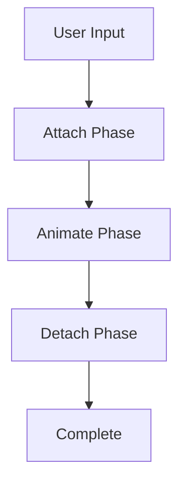

# Animation System

The Rubik's cube features two distinct animation systems: **face rotations** for
cube manipulation and **hover effects** for interactive feedback.

## Face Rotation Animations

### Animation Flow

Face rotations follow a three-phase process:



#### 1. Attach Phase

```typescript
const attachToRotationGroup = useCallback(
    (axis: "x" | "y" | "z", position: number) => {
        const cubesToMove = cubeGroupRef.current.children.filter((child) => {
            child.getWorldPosition(cubePos);
            cubeGroupRef.current!.worldToLocal(cubePos);
            return round(cubePos[axis]) === position;
        });

        cubesToMove.forEach((cube) => {
            rotationGroupRef.current!.attach(cube);
        });
    },
);
```

**Process:**

- Identify cubelets on the specified face
- Transfer them from `cubeGroupRef` to `rotationGroupRef`
- Preserve their world positions during transfer

#### 2. Animate Phase

```typescript
useFrame(() => {
    if (animationState && rotationGroupRef.current) {
        const elapsed = Date.now() - animationState.startTime;
        const progress = Math.min(elapsed / animationState.duration, 1);
        const easedProgress = easeInOutCubic(progress);

        const currentRotation = easedProgress * animationState.targetRotation;
        rotationGroupRef.current.rotation[animationState.axis] =
            currentRotation;
    }
});
```

**Process:**

- Calculate animation progress (0 to 1)
- Apply easing function for smooth motion
- Rotate the entire rotation group

#### 3. Detach Phase

```typescript
const detachFromRotationGroup = useCallback(() => {
    const cubesToMove = [...rotationGroupRef.current.children];
    cubesToMove.forEach((cube) => {
        cubeGroupRef.current!.attach(cube);
    });

    rotationGroupRef.current.rotation.set(0, 0, 0);
});
```

**Process:**

- Move cubelets back to main group
- Reset rotation group orientation
- Preserve new orientations in cubelets

### Easing Function

```typescript
const easeInOutCubic = (t: number) => {
    return t < 0.5 ? 4 * t * t * t : 1 - Math.pow(-2 * t + 2, 3) / 2;
};
```

**Characteristics:**

- Smooth acceleration and deceleration
- Natural feeling motion
- No overshoot or bounce

### Animation State

```typescript
interface AnimationState {
    isAnimating: boolean;
    startTime: number;
    duration: number; // 350ms for smooth but responsive feel
    axis: "x" | "y" | "z";
    position: number; // -1.1, 0, or 1.1
    targetRotation: number; // ±π/2 radians (90 degrees)
    resolve?: () => void; // Promise resolution
}
```

## Hover Animations

### Spring Configuration

Hover effects use `@react-spring/three` for fluid animations:

```typescript
const { scale, animPosition } = useSpring({
    scale: isHovered ? 1.2 : 1,
    animPosition: isHovered ? 0.3 : 0,
    config: { tension: 400, friction: 15 },
});
```

**Spring Properties:**

- **Tension (400)**: High responsiveness for snappy feel
- **Friction (15)**: Moderate damping to prevent oscillation
- **Scale**: 20% size increase when hovered
- **Position**: 0.3 unit movement along normal direction

### Direction Calculation

```typescript
const direction = useMemo(() => new Vector3(x, y, z).normalize(), [x, y, z]);
```

Each cubelet moves away from the cube center along its position vector.

### Animation Application

```typescript
<a.group
    scale={scale as any}
    position={animPosition.to((val) =>
        direction.clone().multiplyScalar(val).toArray()
    )}
>
    {/* Cubelet content */}
</a.group>;
```

**Why This Works:**

- Inner animated group relative to stable outer group
- Rotation calculations remain accurate
- Smooth transitions between hover states

## Ambient Rotation

### Continuous Motion

```typescript
useFrame(() => {
    if (ambientGroupRef.current && !animationState && !hoveredCubelet) {
        ambientGroupRef.current.rotation.y += ambientRotationSpeed;
        ambientGroupRef.current.rotation.x += ambientRotationSpeed * 0.3;
    }
});
```

**Behavior:**

- **Y-axis**: Primary rotation (faster)
- **X-axis**: Secondary rotation (30% of primary speed)
- **Pauses**: During face rotations or hover interactions

### Speed Configuration

```typescript
const [ambientRotationSpeed] = useState(0.002);
```

Slow enough to be pleasant, fast enough to be noticeable.

## Animation Coordination

### State Priorities

1. **Face Rotations**: Highest priority
   - Blocks ambient rotation
   - Blocks new face rotations
   - Allows hover effects

2. **Hover Effects**: Medium priority
   - Blocks ambient rotation
   - Blocks face rotations
   - Multiple cubelets can transition smoothly

3. **Ambient Rotation**: Lowest priority
   - Only active when idle
   - Provides visual interest

### Blocking Logic

```typescript
// Face rotations blocked by hover or existing animation
if (animationState || hoveredCubelet) return Promise.resolve();

// Ambient rotation blocked by any activity
if (ambientGroupRef.current && !animationState && !hoveredCubelet) {
    // Apply ambient rotation
}

// Hover interactions blocked only during face rotations
if (isBlocked) return; // isBlocked = !!animationState
```

## Performance Considerations

### Efficient Updates

- `useFrame` for 60fps animation loops
- Minimal state changes during animations
- Pre-calculated directions and materials

### Memory Management

- Memoized calculations prevent unnecessary recalculations
- Stable function references with `useCallback`
- Clean animation state cleanup

### Smooth Transitions

- Spring animations handle interruptions gracefully
- No jarring stops when switching between hover states
- Proper event propagation control
