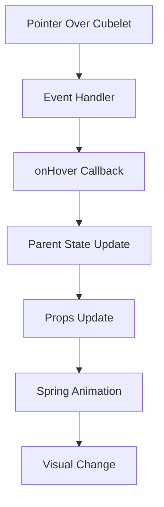

# Hover Effects

The hover system provides interactive feedback when users move their cursor over
individual cubelets. This creates an engaging experience that makes the cube
feel responsive and alive.

## Overview

The hover effect consists of two main animations:

1. **Scale increase** (20% larger)
2. **Pop-out movement** (0.3 units along the cubelet's normal vector)

Both animations use spring physics for natural, fluid motion.

## Implementation Architecture

### Component Hierarchy

```
RubikCube (State Management)
├── Cubelet (Event Handling + Animation)
│   ├── group (Stable Position)
│   └── a.group (Animated)
│       └── mesh (Geometry)
```

### Hover State Flow



## Spring Animation Configuration

### Animation Properties

```typescript
const { scale, animPosition } = useSpring({
    scale: isHovered ? 1.2 : 1,
    animPosition: isHovered ? 0.3 : 0,
    config: { tension: 400, friction: 15 },
});
```

**Parameters Explained:**

- **Scale Range**: 1.0 (normal) → 1.2 (20% larger)
- **Position Range**: 0 (normal) → 0.3 (units away from center)
- **Tension (400)**: High responsiveness for snappy feel
- **Friction (15)**: Moderate damping to prevent oscillation

### Direction Calculation

```typescript
const direction = useMemo(() => new Vector3(x, y, z).normalize(), [x, y, z]);
```

**Movement Direction:**

- Each cubelet moves along its position vector
- Normalized to ensure consistent distance regardless of position
- Always moves away from the cube's center

**Examples:**

- Corner cubelet at (1.1, 1.1, 1.1) → moves along (0.577, 0.577, 0.577)
- Edge cubelet at (1.1, 0, 0) → moves along (1, 0, 0)
- Face cubelet at (0, 1.1, 0) → moves along (0, 1, 0)

## Event Handling

### Pointer Events

```typescript
const handlePointerOver = (e: React.PointerEvent<THREE.Object3D>) => {
    e.stopPropagation();
    onHover(id);
};

const handlePointerOut = (e: React.PointerEvent<THREE.Object3D>) => {
    e.stopPropagation();
    onHover(null);
};
```

**Event Management:**

- `stopPropagation()` prevents multiple cubelets from triggering simultaneously
- Reports cubelet ID on hover enter
- Reports null on hover exit
- Works with mouse, touch, and pen inputs

### State Coordination

```typescript
// In RubikCube component
const [hoveredCubelet, setHoveredCubelet] = useState<string | null>(null);

// Passed to each cubelet
<Cubelet
    onHover={setHoveredCubelet}
    isHovered={hoveredCubelet === id}
/>;
```

## Animation Application

### Group Structure

```typescript
<group position={position}>              {/* Stable for rotations */}
  <a.group                               {/* Animated for hover */}
    scale={scale}
    position={animPosition.to(val => 
      direction.clone().multiplyScalar(val).toArray()
    )}
  >
    <mesh>                               {/* Cubelet geometry */}
      {/* Box geometry and materials */}
    </mesh>
  </a.group>
</group>
```

**Why This Structure:**

- Outer group maintains stable position for rotation calculations
- Inner animated group handles hover effects
- Separation prevents interference between systems

### Position Animation

```typescript
position={animPosition.to(val => 
  direction.clone().multiplyScalar(val).toArray()
)}
```

**Dynamic Calculation:**

- `animPosition` animates from 0 to 0.3
- Direction vector is scaled by current animation value
- Result is converted to array format for Three.js
- Recalculated every frame during animation

## Interaction Blocking

### Blocking Logic

```typescript
// In RubikCube
isBlocked={!!animationState}

// In Cubelet
const handlePointerOver = (e) => {
  e.stopPropagation();
  if (isBlocked) return;  // Block during face rotations
  onHover(id);
};
```

**When Blocked:**

- During face rotation animations
- **Not blocked** during other hover states
- Allows smooth transitions between cubelets

### State Priorities

1. **Face Rotations** → Block new hover states
2. **Existing Hover** → Allow transitions to new hover states
3. **Idle State** → Allow any hover interaction

## Multi-Cubelet Transitions

### Smooth Handoff

When moving cursor between adjacent cubelets:

```typescript
// User moves from cubelet A to cubelet B
onHover("A"); // A becomes hovered
// ... user moves cursor ...
onHover("B"); // B becomes hovered, A automatically unhovered
```

**Animation Behavior:**

- Cubelet A spring animates back to normal (scale=1, position=0)
- Cubelet B spring animates to hovered state (scale=1.2, position=0.3)
- Both animations run simultaneously
- No blocking between hover states

### Performance During Transitions

- Springs handle interruptions gracefully
- No animation restarts or jumps
- Smooth velocity transitions
- Minimal computational overhead

## Visual Feedback

### Scale Effect

```typescript
scale: isHovered ? 1.2 : 1;
```

- **20% size increase** makes the cubelet stand out
- Applied uniformly to all dimensions
- Maintains cubelet proportions

### Pop-out Effect

```typescript
animPosition: isHovered ? 0.3 : 0;
```

- **0.3 unit movement** creates depth perception
- Direction varies per cubelet for natural feel
- Distance is constant for consistent behavior

### Combined Effect

The scale and position changes work together:

- Larger size draws attention
- Movement adds 3D depth
- Creates illusion of "lifting" from the cube

## Accessibility Considerations

### Pointer Support

- Works with mouse, touch, and pen inputs
- No special device-specific handling required
- Consistent behavior across input methods

### Performance

- Smooth 60fps animations on modern devices
- Efficient spring calculations
- Minimal impact on overall application performance

### Visual Clarity

- Clear visual feedback for interaction states
- Sufficient animation magnitude to be noticeable
- Not overwhelming or distracting

## Customization Options

### Animation Tuning

```typescript
config: { tension: 400, friction: 15 }
```

- **Increase tension** for snappier response
- **Decrease tension** for smoother, slower animation
- **Adjust friction** to control settling behavior

### Effect Magnitude

```typescript
scale: isHovered ? 1.2 : 1,           // Adjust scale multiplier
animPosition: isHovered ? 0.3 : 0,     // Adjust movement distance
```

### Timing Override

```typescript
config: { 
  tension: 400, 
  friction: 15,
  mass: 1,        // Add mass for different feel
  clamp: true     // Prevent overshoot
}
```

The hover system creates an intuitive, responsive interface that makes the
Rubik's cube feel like a physical object you can interact with naturally.
