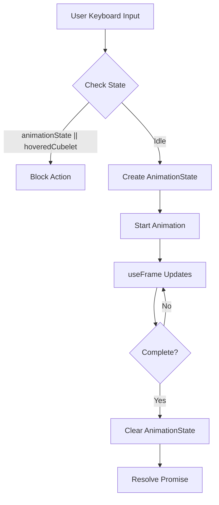
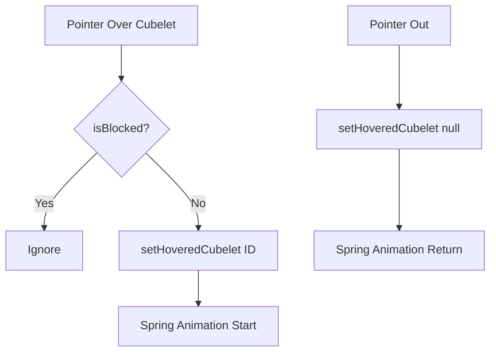

# State Management

The Rubik's cube uses a hierarchical state management system where the parent
`RubikCube` component coordinates global state while individual `Cubelet`
components handle their local presentation.

## Global State (RubikCube)

### Animation State

```typescript
const [animationState, setAnimationState] = useState<AnimationState | null>(
    null,
);

interface AnimationState {
    isAnimating: boolean;
    startTime: number;
    duration: number;
    axis: "x" | "y" | "z";
    position: number;
    targetRotation: number;
    resolve?: () => void;
}
```

**Purpose:** Tracks face rotation animations

- **Single source of truth** for rotation state
- **Prevents concurrent** face rotations
- **Promise-based** for async/await support
- **Cleanup handling** via resolve callback

### Hover State

```typescript
const [hoveredCubelet, setHoveredCubelet] = useState<string | null>(null);
```

**Purpose:** Tracks which cubelet is currently hovered

- **Centralized control** prevents conflicts
- **String ID** allows precise identification
- **Null state** represents no hover
- **Enables smooth transitions** between cubelets

### Configuration State

```typescript
const [ambientRotationSpeed] = useState(0.002);
const [animationDuration] = useState(350);
```

**Purpose:** Global animation parameters

- **Consistent timing** across all animations
- **Tunable performance** characteristics
- **Single point of control** for speed adjustments

## State Flow Patterns

### Face Rotation Flow



### Hover Flow



## State Synchronization

### Parent-to-Child Props

```typescript
<Cubelet
    id={id}
    position={position}
    onHover={setHoveredCubelet} // Callback for state updates
    isHovered={hoveredCubelet === id} // Derived state
    isBlocked={!!animationState} // Computed blocking state
/>;
```

**Data Flow:**

- **Downward**: State flows from parent to children via props
- **Upward**: Events flow from children to parent via callbacks
- **Computed**: Derived state calculated in parent

### Event Handling

```typescript
// Cubelet reports hover state changes
const handlePointerOver = () => {
    onHover(id); // Reports its ID to parent
};

const handlePointerOut = () => {
    onHover(null); // Reports no hover to parent
};
```

## State Coordination

### Blocking Logic

Different states block different actions:

```typescript
// Face rotations check multiple conditions
const canRotate = !animationState && !hoveredCubelet;

// Ambient rotation checks all activity
const canAmbientRotate = !animationState && !hoveredCubelet;

// Hover interactions only blocked by face rotations
const canHover = !animationState;
```

**State Priority:**

1. **Face Rotations** (highest) - block everything
2. **Hover Effects** (medium) - block rotations and ambient
3. **Ambient Rotation** (lowest) - only when idle

### State Transitions

#### Idle → Face Rotation

```typescript
const animateXFace = async (xpos: number, direction: number) => {
    if (animationState || hoveredCubelet) return;

    setAnimationState({
        isAnimating: true,
        startTime: Date.now(),
        // ... other properties
    });
};
```

#### Idle → Hover

```typescript
// User hovers cubelet
onHover("1.1-0--1.1"); // Parent receives ID
// Parent updates state
setHoveredCubelet("1.1-0--1.1");
// Cubelet receives isHovered=true
// Spring animation starts
```

#### Hover → Different Hover

```typescript
// User moves to different cubelet
onHover("0-1.1-1.1"); // New ID reported
// Parent updates state immediately
setHoveredCubelet("0-1.1-1.1");
// Previous cubelet gets isHovered=false
// New cubelet gets isHovered=true
// Both animations update simultaneously
```

## Performance Optimizations

### Stable References

```typescript
const attachToRotationGroup = useCallback((axis, position) => {
    // Implementation
}, [round]);

const animateXFace = useCallback((xpos, direction) => {
    // Implementation
}, [animationState, attachToRotationGroup, animationDuration]);
```

**Benefits:**

- Prevents unnecessary re-renders
- Stable dependency arrays
- Consistent function identity

### Computed State

```typescript
// Computed in render, not stored in state
const isBlocked = !!animationState;
const isHovered = hoveredCubelet === id;
```

**Benefits:**

- Always up-to-date
- No synchronization issues
- Minimal state storage

### Memoized Values

```typescript
const materials = useMemo(() => generateMaterials(x, y, z), [x, y, z]);
const direction = useMemo(() => new Vector3(x, y, z).normalize(), [x, y, z]);
```

**Benefits:**

- Expensive calculations cached
- Referential stability for dependencies
- Prevents unnecessary work

## Debugging State

### State Inspection

The `RubikCubeRef` exposes current state:

```typescript
export interface RubikCubeRef {
    isAnimating: boolean; // Current animation status
    // ... methods
}

useImperativeHandle(ref, () => ({
    isAnimating: !!animationState,
    // ... other methods
}));
```

### Console Debugging

Add temporary logging for state changes:

```typescript
useEffect(() => {
    console.log("Animation State:", animationState);
}, [animationState]);

useEffect(() => {
    console.log("Hovered Cubelet:", hoveredCubelet);
}, [hoveredCubelet]);
```

## Error Handling

### Animation Cleanup

```typescript
useFrame(() => {
    if (animationState && rotationGroupRef.current) {
        // ... animation logic

        if (progress >= 1) {
            detachFromRotationGroup();
            setAnimationState(null);
            animationState.resolve?.(); // Clean promise resolution
        }
    }
});
```

### Defensive Checks

```typescript
// Prevent operations without required refs
if (!cubeGroupRef.current || !rotationGroupRef.current) return;

// Handle missing animation state
animationState.resolve?.(); // Optional chaining for safety
```

This state management approach ensures:

- **Predictable behavior** through clear state ownership
- **Smooth interactions** via proper coordination
- **Performance** through optimized updates
- **Maintainability** through clear separation of concerns
